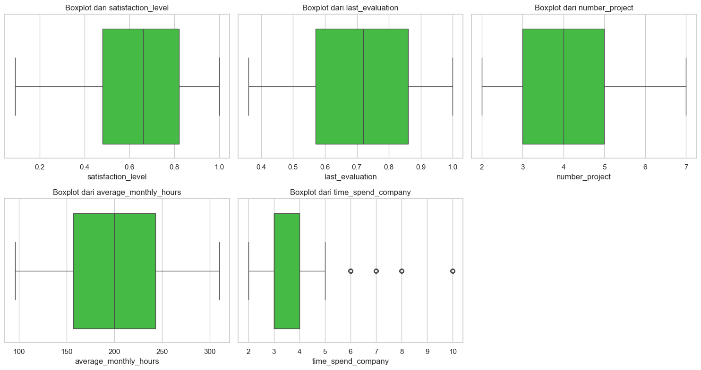

# Laporan Proyek Machine Learning - Ucok Simbolon

## 1. Domain Proyek

Dalam dunia bisnis, memahami perilaku karyawan adalah salah satu aspek penting untuk meningkatkan efisiensi dan produktivitas perusahaan [1]. Penelitian ini berfokus pada analisis data karyawan untuk memprediksi apakah seorang karyawan akan berhenti bekerja (resign) atau tetap bekerja di perusahaan. Dataset yang digunakan dalam penelitian ini berasal dari Kaggle dengan nama "HR Analytics and Job Prediction" [2]. Dataset ini mencakup 14.999 baris data dengan berbagai atribut yang relevan, seperti tingkat kepuasan kerja, evaluasi terakhir, jumlah proyek, rata-rata jam kerja bulanan, dan lainnya.

Masalah ini penting untuk diselesaikan karena tingkat turnover karyawan yang tinggi dapat menyebabkan kerugian finansial dan operasional bagi perusahaan [3]. Dengan menggunakan pendekatan machine learning, perusahaan dapat mengidentifikasi faktor-faktor yang memengaruhi keputusan resign dan mengambil langkah-langkah preventif untuk meningkatkan retensi karyawan.

**Referensi:**

[1] M. Patterson, P. Warr, and M. West, “Organizational climate and company productivity: The role of employee affect and employee level,” Journal of Occupational and Organizational Psychology, vol. 77, no. 2, pp. 193–216, Jun. 2004, doi: https://doi.org/10.1348/096317904774202144.
‌

[2] M. Faisal Qureshi, "HR Analytics and Job Prediction," Kaggle, 2023. [Online]. Available: https://www.kaggle.com/datasets/mfaisalqureshi/hr-analytics-and-job-prediction/data. [Accessed: 2023-10-01].

[3]A. C. Glebbeek and E. H. Bax, “IS HIGH EMPLOYEE TURNOVER REALLY HARMFUL? AN EMPIRICAL TEST USING COMPANY RECORDS.,” Academy of Management Journal, vol. 47, no. 2, pp. 277–286, Apr. 2004, doi: https://doi.org/10.2307/20159578.
‌

## 2. Business Understanding

### 2.1. Problem Statements

Penelitian ini bertujuan untuk menjawab beberapa pertanyaan utama:
1. Faktor apa saja yang memengaruhi keputusan karyawan untuk resign?
2. Bagaimana hubungan antara variabel-variabel seperti tingkat kepuasan kerja, jam kerja bulanan, dan promosi terhadap keputusan resign?
3. Dapatkah model machine learning digunakan untuk memprediksi status resign karyawan dengan akurasi tinggi?

### 2.2. Goals

Tujuan dari penelitian ini adalah:
1. Mengidentifikasi faktor-faktor utama yang memengaruhi keputusan resign karyawan.
2. Mengembangkan model prediksi yang dapat memprediksi status resign karyawan dengan akurasi tinggi.
3. Memberikan rekomendasi berbasis data untuk meningkatkan retensi karyawan.

### 2.3. Solution Statements

Untuk mencapai tujuan tersebut, penelitian ini akan melakukan analisis terhadap dataset yang digunakan, lalu untuk prediksi, akan menggunakan beberapa algoritma machine learning untuk klasifikasi, yaitu Naive Bayes, Random Forest Classifier, dan XGBoost. Model ini dipilih karena kemampuannya dalam menangani data dengan fitur yang kompleks, dan tidak terlalu membutuhkan scaling pada datasetnya. Proses tuning hyperparameter dilakukan untuk meningkatkan performa model. Evaluasi model dilakukan menggunakan metrik seperti akurasi, precision, recall, F1-score, MSE, dan cross-validation dengan learning curve.

## 3. Data Understanding

Dataset yang digunakan merupakan dataset sekunder yang didapat dari situs Kaggle dengan nama [Hr Analytics Job Prediction](https://www.kaggle.com/datasets/mfaisalqureshi/hr-analytics-and-job-prediction/data). Dataset ini terdiri dari 10 fitur utama, yaitu:
- **satisfaction_level**: Tingkat kepuasan kerja karyawan.
- **last_evaluation**: Skor evaluasi terakhir karyawan.
- **number_project**: Jumlah proyek yang telah dikerjakan.
- **average_monthly_hours**: Rata-rata jam kerja bulanan.
- **time_spend_company**: Lama waktu bekerja di perusahaan (tahun).
- **work_accident**: Apakah karyawan pernah mengalami kecelakaan kerja (0: tidak, 1: iya).
- **promotion_last_5years**: Apakah karyawan mendapatkan promosi dalam 5 tahun terakhir (0: tidak, 1: iya).
- **department**: Departemen tempat karyawan bekerja.
- **salary**: Tingkat gaji karyawan (low, medium, high).
- **left**: Status resign karyawan (0: tidak, 1: iya).

Adapun rangkuman dari dataset ini dapat dilihat pada gambar berikut

Awalnya, dataset ini terdiri atas 14999 baris. Kemudian dilakukan pengecekan kualitas data, seperti data yang kosong (missing values), data duplikat, dan data outliers. Tidak ada data kosong pada dataset ini, namun terdapat data duplikat dan outliers pada dataset. Karena outliers pada data tidak extreme, maka peneliti tidak menangani outlier tersebut. Peneliti hanya menangani data duplikat pada dataset dengan cara menghapus data duplikat tersebut. Jadi seteleah proses pembersihan data, total data pada dataset ini adalah 11991 baris.

### Exploratory Data Analysis (EDA)

Analisis eksplorasi dilakukan untuk memahami distribusi data dan hubungan antar fitur. Gambar distribusi fitur numerik dapat dilihat pada . Dari analisis ini, ditemukan bahwa fitur seperti **satisfaction_level**, **average_monthly_hours**, dan **time_spend_company** memiliki distribusi yang dapat dikaitkan dengan keputusan resign.

Selain itu, analisis hubungan antar fitur dilakukan menggunakan scatterplot dan boxplot. Contohnya, hubungan antara **average_monthly_hours**, **satisfaction_level**, dan **left** ditampilkan pada [Gambar 9](img/9.png). Scatterplot ini menunjukkan bahwa karyawan dengan tingkat kepuasan rendah dan jam kerja tinggi cenderung resign.

## Data Preparation

Proses data preparation meliputi:
1. **Pembersihan Data**: Menghapus data duplikat, seperti yang ditunjukkan pada [Gambar 2](img/2.png).
2. **Standarisasi Nama Kolom**: Nama kolom diubah menjadi huruf kecil untuk konsistensi.
3. **Penanganan Outlier**: Outlier pada fitur **time_spend_company** dideteksi tetapi tidak dihapus karena tidak terlalu ekstrem ([Gambar 3](img/3.png)).
4. **Encoding Data Kategorikal**: Fitur seperti **department** dan **salary** diubah menjadi format numerik menggunakan one-hot encoding.

## Modeling

Model yang digunakan dalam penelitian ini adalah Random Forest Classifier. Model ini dipilih karena kemampuannya dalam menangani data dengan fitur yang kompleks dan memberikan interpretasi melalui feature importance. Proses tuning hyperparameter dilakukan menggunakan GridSearchCV untuk meningkatkan performa model.

### Evaluasi Model

Evaluasi model dilakukan menggunakan metrik akurasi, precision, recall, dan F1-score. Hasil evaluasi sebelum dan setelah tuning ditampilkan pada [Gambar 19](img/19.png). Model yang telah dituning menunjukkan peningkatan akurasi dan performa keseluruhan.

Learning curve model sebelum dan setelah tuning ditampilkan pada [Gambar 20](img/20.png). Grafik ini menunjukkan bahwa model memiliki performa yang stabil dengan dataset yang lebih besar.

### Feature Importance

Feature importance dari model Random Forest ditampilkan pada [Gambar 21](img/21.png). Fitur **satisfaction_level** memiliki kontribusi terbesar dalam prediksi status resign, diikuti oleh **number_project** dan **time_spend_company**.

## Evaluation

Model yang dikembangkan berhasil mencapai akurasi tinggi dalam memprediksi status resign karyawan. Berdasarkan hasil evaluasi, fitur-fitur seperti **satisfaction_level**, **average_monthly_hours**, dan **time_spend_company** memiliki korelasi yang signifikan dengan keputusan resign. Model ini dapat digunakan oleh perusahaan untuk mengidentifikasi karyawan yang berisiko resign dan mengambil langkah-langkah preventif.

## Referensi

[1] M. Faisal Qureshi, "HR Analytics and Job Prediction," Kaggle, 2023. [Online]. Available: https://www.kaggle.com/datasets/mfaisalqureshi/hr-analytics-and-job-prediction/data. [Accessed: 2023-10-01].